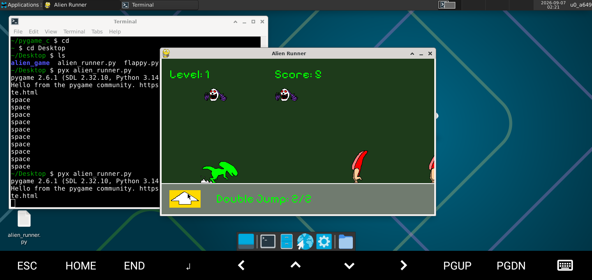
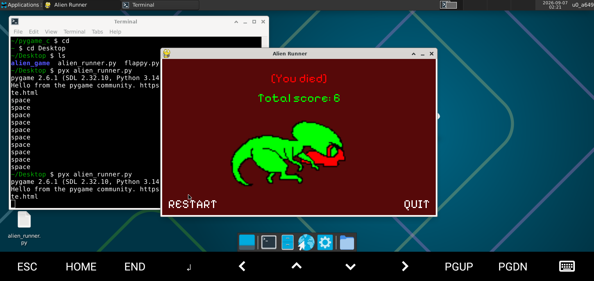
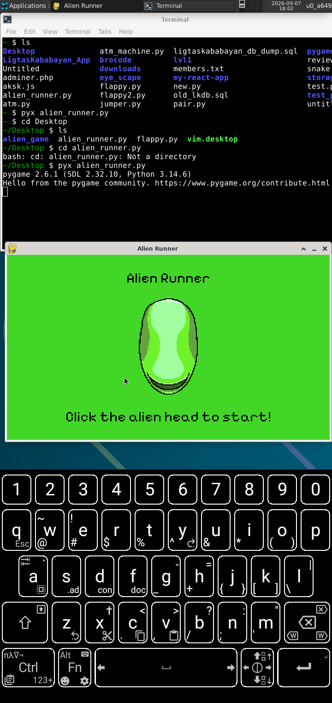
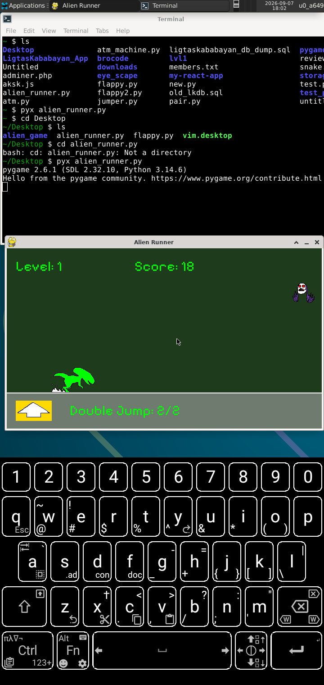
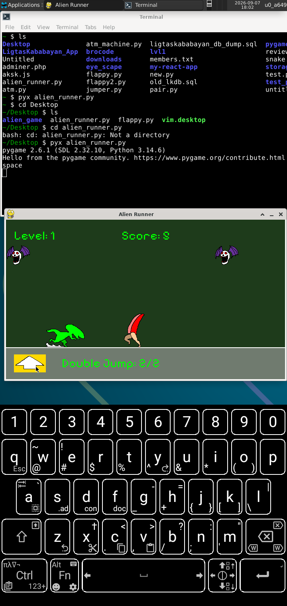
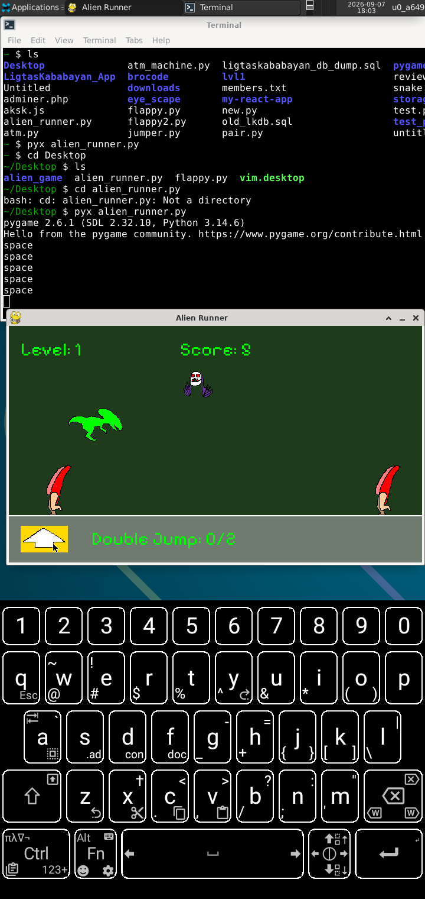
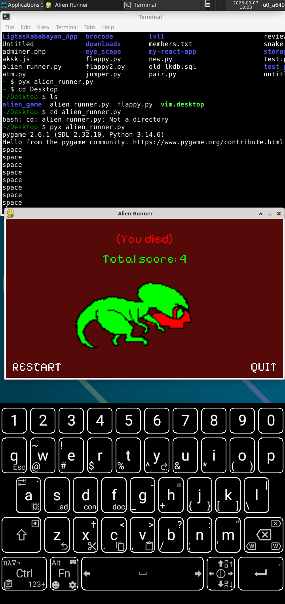

# Alien Runner Game
- Just a running + jumping game similar to chromes offline dino game except here the Alien can't duck.
- Built entirely on phone

# Apps i used
- Termux
- IDE: NVIM in Termux.
- PixelStation app to create the characters design.
- Termux:X11 as a way to generate a window with pixels.

# Screenshots

#dd

